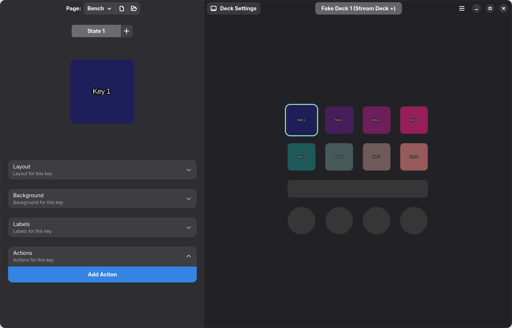

# Deckard

Stream Deck controller for Linux. Rust engine. GTK4/libadwaita editor. No Python runtime.

## Download

**[Deckard 0.9.1](https://github.com/pauljones0/Deckard/releases/tag/v0.9.1)**

| Linux | x86-64 · Intel/AMD | ARM64 |
| --- | --- | --- |
| CachyOS | [pacman package](https://github.com/pauljones0/Deckard/releases/download/v0.9.1/deckard-0.9.1-cachyos-x86_64.pkg.tar.zst) | — |
| Fedora 44 stable | [RPM](https://github.com/pauljones0/Deckard/releases/download/v0.9.1/deckard-0.9.1-fedora44-x86_64.rpm) | [RPM](https://github.com/pauljones0/Deckard/releases/download/v0.9.1/deckard-0.9.1-fedora44-aarch64.rpm) |
| Ubuntu 26.04 LTS | [DEB](https://github.com/pauljones0/Deckard/releases/download/v0.9.1/deckard-0.9.1-ubuntu26-x86_64.deb) | [DEB](https://github.com/pauljones0/Deckard/releases/download/v0.9.1/deckard-0.9.1-ubuntu26-aarch64.deb) |

Open the DEB/RPM in your software installer. CachyOS: `sudo pacman -U ./deckard-0.9.1-cachyos-x86_64.pkg.tar.zst`. Your package manager installs the libraries and helpers. Reconnect your deck, then launch Deckard. [Builds and setup](docs/linux-builds.md).

**Store → Pages → Rust Starter** installs a ready-made page.

## Features

- The previous GTK layout, rebuilt in Rust: keys, dials, touchscreens, pages, states and grouped controls.
- OS, media, OBS and volume controls: 56 built-in actions replacing the common upstream plugins.
- Native device resolution. Auto FPS follows the source, up to 120 FPS, adapting to USB throughput.
- Animated wallpapers, asset browsing, automatic page switching and close-to-tray.

Supports Elgato, Mirabox and Ulanzi. [Models](docs/rendering-endpoints.md) · [Usage](docs/user-guide.md).

Python plugins need native replacements. **Settings → Inspect legacy actions** migrates supported actions. [Migration](docs/plugin-migration.md) · [Plugin API](docs/native-plugins.md).

## Less CPU. Less RAM.

Historical upstream comparison with eight animated Plus keys, using Rust 0.5.0. Current GTK measurements are tracked in [performance results](docs/performance.md).

| Mode | StreamController CPU / RAM | nazbert/Deckard CPU / RAM | Rust 0.5.0 CPU / RAM |
| --- | ---: | ---: | ---: |
| Editor | 6.33% / 339 MiB | 3.80% / 303 MiB | **1.83% / 176 MiB** |
| Background | 4.07% / 197 MiB | 2.23% / 195 MiB | **0.80% / 16 MiB** |

CPU is percent of one core; RAM is process-tree PSS. Three trials per case on a Ryzen 9800X3D / RTX 5070, using fake devices. USB/LCD and ARM performance remain unmeasured.

## Build

`scripts/build-linux.sh` builds distro-native packages. [Build details](docs/linux-builds.md) · [GTK editor](docs/ui-restoration.md) · [All docs](docs/README.md).

Based on [StreamController](https://github.com/StreamController/StreamController) by Core447 and [nazbert/Deckard](https://github.com/nazbert/Deckard). [Upstream audit](docs/upstream-audit.md). [GPL-3.0-or-later](LICENSE).
