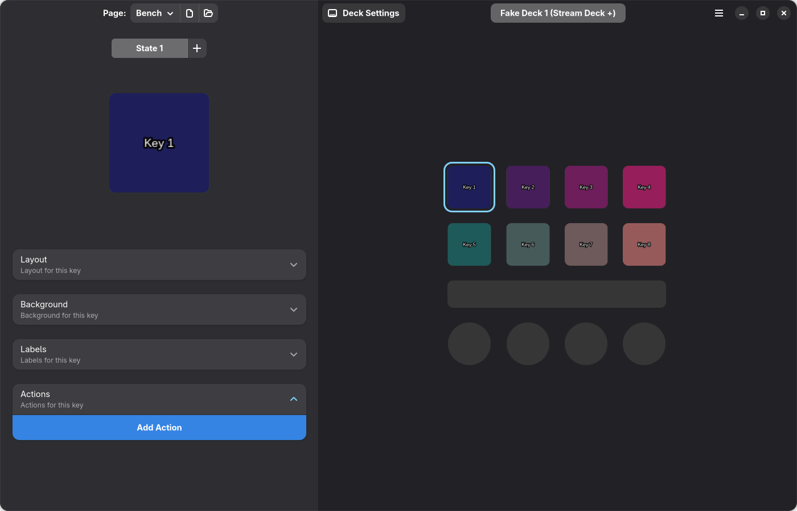

# Restore the GTK editor in Rust

Use GTK 4 and libadwaita through their Rust bindings. Keep the existing Rust engine, native actions and executable plugin API. Rebuild the previous widget tree and handlers in Rust, retaining its CSS and assets.

**This is a verified migration plan. The released editor still uses egui.**

## What went wrong

The port's [editor](../rust/launcher/src/ui.rs) uses default egui controls, a fixed two-column layout and inline forms. It replaced the previous editor's header bars, state switcher, selected-key preview, grouped settings, action chooser and dialogs. Rust did not require that redesign.

The [previous window](../src/windows/mainWindow/mainWindow.py) is an `Adw.ApplicationWindow` containing `Adw.NavigationSplitView`. Its sidebar is on the left, with a preferred width of 40%, bounded to 450–600 logical pixels. Default window size is 1400×900; minimum is 800×700. The deck view occupies the remaining area. Keys display at 75 logical pixels and the selected-key preview at 175. These display sizes are independent of the controller's native pixel resolution.



Captured from nazbert/Deckard with a fake Plus. The striped header marks development mode; it is not part of the normal editor theme.

## Native feasibility check

A standalone Rust executable was compiled and run against the actual `deckard-core`. It used `gtk4` 0.11.5 and `libadwaita` 0.9.2, with system GTK 4.22.4 / libadwaita 1.9.3.

Verified: all eight 120×120 engine frames display, a GTK click selects another key, an entry change updates that key through `set-property`, the edit reaches the saved JSON, and unknown page fields survive. Process mappings contain GTK/libadwaita and no libpython. This probe covers selection and label editing, not the full frontend or its performance.

Local source and validation: `target/gtk-ui-proof/src/main.rs`, `target/gtk-ui-research/verification.json`. The existing stylesheet produced the same invalid `:toggled` selector warning in both applications; remove that unused rule during the UI port.

## Widget mapping

| Previous component | Rust implementation |
| --- | --- |
| `MainWindow`, `DeckSwitcher`, `PageSelector` | `adw::ApplicationWindow`, `NavigationSplitView`, paired `HeaderBar`s, `gtk::StackSwitcher`, searchable page menu |
| `LeftArea`, `DeckStack`, `DeckStackChild` | Persistent device widgets and `gtk::Stack` pages; explicit disconnected/empty states |
| `KeyGrid`, `KeyButton` | `gtk::Grid`, styled `Frame`/`Image`, gesture and shortcut controllers |
| `ScreenBar`, `DialBox` | Native strip preview and dial widgets mapped through `render::layout` / `logical_input` |
| `Sidebar`, `StateSwitcher`, `IconSelector` | Scrolled editor stack, state buttons, image overlay with hover/select/remove controls |
| `ImageEditor`, `BackgroundEditor`, `LabelEditor` | `adw::PreferencesGroup` / `ExpanderRow` with the previous size, alignment, color and font controls |
| `ActionManager`, `ActionChooser`, `ActionConfigurator` | Action rows, search/category navigation, drag/drop ordering and typed settings |
| Page/deck/settings/store/asset windows | GTK/Adwaita windows and dialogs connected to existing native services |

Use [style.css](../style.css), the existing icons and locale strings. Recreate custom `GtkHelper` controls in Rust. Python widget classes cannot be imported into the native application. The five common plugin integrations get GTK settings forms backed by their existing native action schemas; external executable plugins keep declaring fields through the native API.

## Engine bridge

Keep GTK objects on the main thread. A bounded command worker handles persistence, catalog downloads and other blocking work. Commands carry the selected serial/page/input/state and a request token; responses update only the matching editor selection. Do not drop queued edits when busy.

| UI operation | Existing engine path |
| --- | --- |
| Select page/state | `change-page`, `change-state` |
| Edit a label, image or background field | `set-property` |
| Edit actions/full state | `set-state`, merging against the current document |
| Add/remove state | `add-state`, `remove-state` |
| Sticky inputs | `get-sticky`, `put-sticky` |
| Page management and settings | Existing page commands, `settings`, `put-settings` |
| Test input/dial/touch gesture | `Runtime.events` with `InputEvent` |

The preview bridge waits on `Engine.frame_ready`, retains only the latest `Arc<Frame>` per device and schedules one main-thread drain. Release the engine lock before touching widgets. Check device epoch, document revision and tile identity before applying an update. Keep document updates separate from frame traffic so animation cannot hide a saved edit.

Add coalesced notifications for connection, document, error, show-window and shutdown changes that do not produce a frame. `frame_ready` alone cannot cover disconnected or hidden-window transitions. GTK callbacks use weak widget references; stop subscriptions and workers on teardown.

Wrap `Tile.rgb.clone()` with `glib::Bytes::from_owned`, then create `gdk::MemoryTexture` using `R8g8b8` and a stride of `width * 3`. The probe verified that this wrapper retains the original RGB buffer without copying it. GTK may still copy/upload pixels internally. Never decode device JPEGs for the preview. Update only changed tiles, and disconnect preview observers/release textures while hidden. Device rendering and USB pacing continue independently.

## Build and packaging

Add optional GUI dependencies to [the launcher](../rust/launcher/Cargo.toml):

```toml
gtk = { package = "gtk4", version = "0.11.5", features = ["v4_16"], optional = true }
adw = { package = "libadwaita", version = "0.9.2", features = ["v1_6"], optional = true }
```

Use separate `ui-gtk` / `ui-egui` Cargo features during migration. Move toolkit-independent action definitions and editing logic out of `ui.rs`; preserve CLI, tray, IPC and lazy window startup. A build without GUI features should retain daemon/control functionality. Once GTK reaches parity, make it the release default and remove egui/eframe/wgpu dependencies.

The split view requires libadwaita 1.4; the existing CSS variables require GTK 4.16. Target GTK 4.16+ / libadwaita 1.6+ for the retained styling. Ubuntu 26.04 LTS and supported Fedora releases already supply suitable versions. Use their system libraries instead of bundling a newer GTK stack for Ubuntu 22.04.

Build the DEB inside Ubuntu 26.04 and the RPM inside each supported Fedora release, on both x86_64 and aarch64. Fedora has no LTS edition; follow its supported stable releases. Install application files under standard `/usr` paths and declare runtime dependencies on GTK, libadwaita and required resources. Use Debian shared-library dependency generation and RPM automatic dependency detection; the graphical package installer can install missing dependencies even on a non-GNOME desktop. Do not repackage the Ubuntu-built binary as a Fedora RPM.

Keep GTK, GLib, Pango, Cairo, toolkit modules and schemas out of these native application packages. The distribution supplies and updates them. Retain the Python payload rejection. File dialogs should use the desktop portal; media playback stays in the existing Rust/FFmpeg renderer. Existing helper/FFmpeg packaging is a separate choice.

Portable archives and AppImages do not install dependencies. They need either an explicitly documented modern system-library requirement or a bundled toolkit for broader compatibility. Native DEB/RPM builds are the default installation path for the restored editor. The current egui release packages retain their existing compatibility claims until the GTK replacement is built and verified.

## Implementation order and acceptance

1. Restore the shell, device grid, strip/dials, page/state selection and selected-key preview. Compare against the previous editor at matching window sizes and scales.
2. Restore typed layout/background/label/action controls, shortcuts, clipboard, drag/drop and missing-action states. Preserve unknown JSON and all 56 native actions.
3. Restore page/deck settings, asset selection, store, migration, OBS/mixer configuration and close-to-tray behavior. Avoid permanent JSON-only substitutes for the previous controls.
4. Verify every model's geometry, reconnection, page changes during editing, hidden/reopened windows, and worker cancellation. Run existing native tests plus GTK interaction checks on X11 and Wayland.
5. Build/install DEBs on clean Ubuntu 26.04 systems and RPMs on clean supported Fedora systems, on both architectures. Verify dependency installation on GNOME and non-GNOME desktops, dialogs/icons/USB setup, and screenshots before switching the default frontend. Validate any portable/AppImage builds separately against their stated requirements and relocation behavior.
6. Repeat visible, hidden and never-opened CPU/PSS measurements with identical workloads. The Rust engine optimizations remain, but the GTK frontend's resource cost must be measured; egui benchmark results do not establish GTK performance.

## Sources

- [Official GTK Rust bindings](https://www.gtk.org/docs/language-bindings/rust/)
- [Libadwaita in Rust](https://gtk-rs.org/gtk4-rs/stable/latest/book/libadwaita.html)
- [NavigationSplitView requirements](https://gnome.pages.gitlab.gnome.org/libadwaita/doc/1-latest/class.NavigationSplitView.html)
- [GTK CSS properties and version requirements](https://docs.gtk.org/gtk4/css-properties.html)
- [GLib owned bytes](https://docs.rs/glib/latest/glib/struct.Bytes.html#method.from_owned)
- [Ubuntu 26.04 GTK](https://packages.ubuntu.com/resolute-updates/libs/libgtk-4-1) / [libadwaita](https://packages.ubuntu.com/resolute-updates/libs/libadwaita-1-0)
- [Fedora GTK](https://packages.fedoraproject.org/pkgs/gtk4/gtk4/) / [libadwaita](https://packages.fedoraproject.org/pkgs/libadwaita/libadwaita/)
- [Fedora release lifecycle](https://docs.fedoraproject.org/en-US/releases/lifecycle/)
